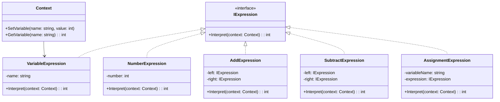
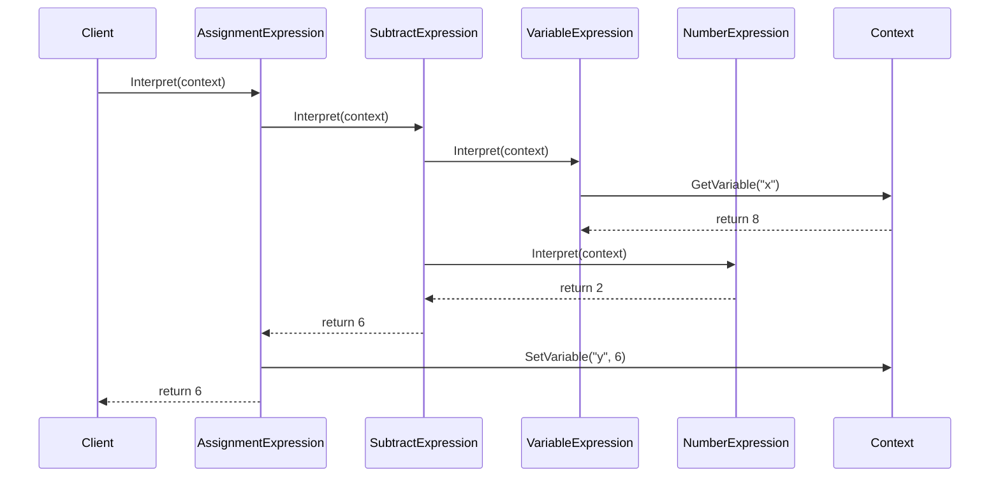

# Interpreter Design Pattern — C# .NET Implementation

## 📖 Overview
The **Interpreter Design Pattern** defines a grammar for a language and provides an interpreter to evaluate sentences in that language.  
The pattern relies on turning a sentence or expression into an **Abstract Syntax Tree (AST)**— a tree structure where every node represents a grammatical rule. There are two main types of expressions:

- **Terminal Expression:** The leaf nodes. These evaluate directly to a value (e.g., a literal number or a variable).
- **Non-Terminal Expression:** The branches. These combine other expressions using rules (e.g., addition, subtraction, or logical AND).

This implementation supports **arithmetic operations** (`+`, `-`) and **assignment** (`=`) with **variables**.

---

## 🧩 Class Diagram



---

## 📐 Sequence Diagram

### Scenario: `y = x - 2`



---

## 📐 Design Principles Applied

- **SRP:** Each expression class interprets only its own rule.  
- **OCP:** New grammar rules can be added without modifying existing ones.  
- **Composite:** Expressions form an AST representing complex statements.  
- **Encapsulation:** Context manages variable storage.  
- **Loose Coupling:** Interpreter works with abstractions (`IExpression`).  

---

## ✅ Pros and ❌ Cons

### Pros
- Easy to extend grammar.  
- Clear separation of responsibilities.  
- Useful for DSLs and rule engines.  

### Cons
- Complex grammars → large class hierarchies.  
- Performance overhead for deep ASTs.  
- Not suitable for full-fledged programming languages.  

---
---

## ⚖️ Trade-offs: When to Use (and When to Avoid)

The Interpreter pattern is highly specialized. It shines bright in very specific scenarios but can easily ruin a codebase if misused.

### ✅ The Good
- **Easy to extend:** Adding a new grammatical rule or operation just means creating a new class implementing `IExpression`.  
- **Separation of concerns:** Grammar rules are kept clean and decoupled from parsing logic.  
- **Highly readable rules:** Complex business logic can be represented as readable object chains.  

### ❌ The Bad
- **Performance issues:** For deep trees, recursive evaluation can become slow and memory-intensive.  
- **Complex parsing required:** The pattern doesn’t explain how to parse raw strings into trees; you still need a parser/lexer.  
- **Maintenance overhead:** If grammar grows to hundreds of rules, managing all those classes becomes a nightmare.  

### 📌 Crucial Rule of Thumb
If your grammar starts growing past a few basic rules, **drop this design pattern** and use an industrial parser generator like **ANTLR** or **Lex/Yacc** instead.

---

## 🌍 Real-World Applications
- Mathematical expression evaluation  
- Domain-Specific Languages (DSLs)  
- Rule engines  
- Query interpreters (SQL, regex-like engines)  

---
```