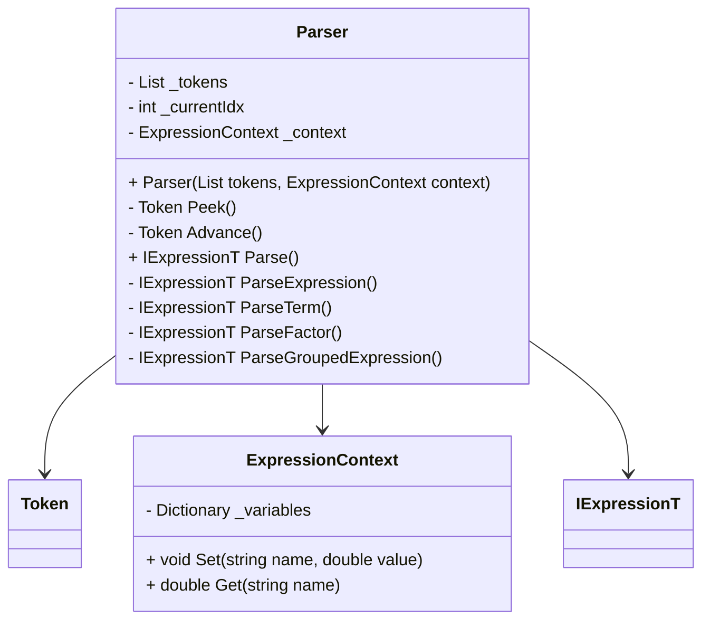
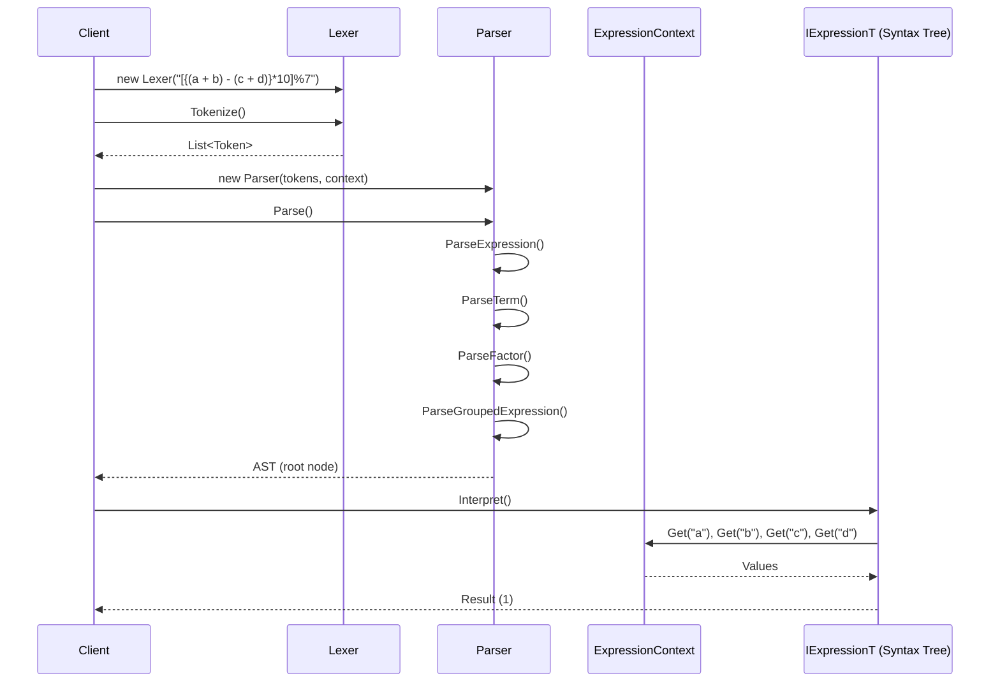

# Parsing Mechanism Design

## Overview
This document details the design of the **Lexer** and **Parser** components in the Interpreter Pattern implementation.  
The goal is to transform raw mathematical expressions into an **Abstract Syntax Tree (AST)** that can be evaluated according to **BODMAS precedence rules**.

---

## 1. Lexer Design

### Responsibilities
- Converts raw input strings into a sequence of **tokens**.
- Recognizes:
  - Parentheses/brackets/braces
  - Arithmetic operators (+, -, *, /, %)
  - Numeric literals (integers and floating-point)
  - Identifiers/variables

### Key Methods
- `Peek()` → Look at current character without advancing.
- `Advance()` → Move to next character.
- `Tokenize()` → Produce a list of `Token` objects.

### Class Diagram
```mermaid
classDiagram
    class Lexer {
        - string _src
        - int _pos
        + Lexer(string input)
        - char Peek()
        - char Advance()
        + List<Token> Tokenize()
    }

    class Token {
        + TokenType Type
        + string Value
        + Token(TokenType type, string value)
        + string ToString()
    }

    enum TokenType {
        Number
        Variable
        Plus
        Minus
        Multiply
        Divide
        Modulo
        OpenParenthesis
        CloseParenthesis
        EOF
    }

    Lexer --> Token
    Token --> TokenType
```

---

## 2. Parser Design

### Responsibilities
- Consumes tokens produced by the **Lexer**.
- Builds an **AST** of `IExpressionT` nodes.
- Implements recursive descent parsing with operator precedence:
  - **Layer 1**: Addition & Subtraction
  - **Layer 2**: Multiplication, Division, Modulo, Implicit Multiplication
  - **Layer 3**: Parentheses, Variables, Numbers

### Key Methods
- `Parse()` → Entry point, returns root AST node.
- `ParseExpression()` → Handles addition/subtraction.
- `ParseTerm()` → Handles multiplication/division/modulo.
- `ParseFactor()` → Handles literals, variables, grouped expressions.
- `ParseGroupedExpression()` → Validates bracket pairs.

### Class Diagram


---

## 3. Sequence Diagram

### Example: Parsing `[{(a + b) - (c + d)}*10]%7`


---

## 4. Error Handling
- **Lexer**:
  - Throws `FormatException` for unknown characters.
- **Parser**:
  - Throws `FormatException` for mismatched or unexpected brackets/tokens.
- **Expressions**:
  - Division/Modulo expressions throw `DivideByZeroException` if denominator is zero.

---

## 5. Design Benefits
- **Separation of Concerns**: Lexer handles tokenization, Parser handles syntax, Expressions handle evaluation.
- **Extensibility**: New operators (e.g., power `^`) can be added by extending `TokenType` and parser rules.
- **Readability**: Recursive descent parsing mirrors natural grammar rules.
- **Robustness**: Defensive coding with null checks and exception handling.

---
```