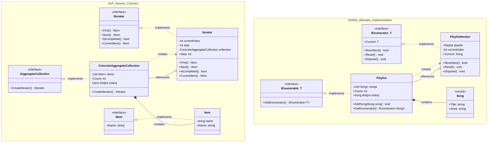
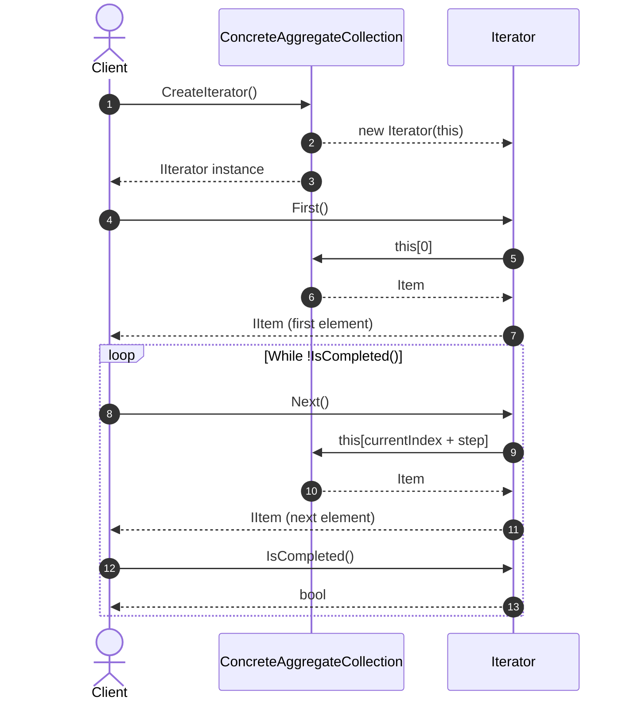
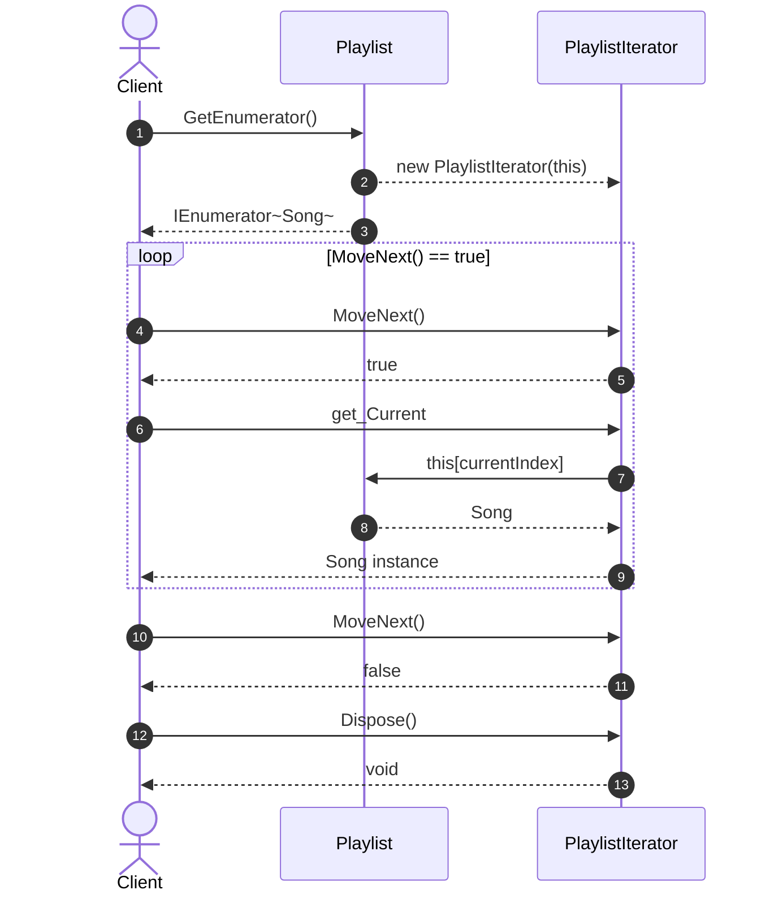

# Iterator Design Pattern

## Overview

The **Iterator Design Pattern** is a behavioral design pattern that provides a standardized way to access elements of an aggregate object sequentially without exposing its underlying internal data structure (such as arrays, linked lists, trees, or hash tables).

In modern software development and C# architecture, the pattern comes in two primary forms:

1. **Classic Gang of Four (GoF) Approach (Generic Interface Driven):** Custom abstractions (`IAggregateCollection`, `IIterator`) giving explicit control over step sizes, bi-directional pointers, or indexing mechanics.
2. **Idiomatic .NET Architecture (Typical Implementation):** Framework-native contracts (`IEnumerable<T>`, `IEnumerator<T>`) designed for compile-time optimizations, the `foreach` keyword, and LINQ composition.

---

## Real-World Use Cases

* **Encapsulating Custom Data Structures:** Traversing non-linear structures (such as Binary Search Trees, Graphs, or Skip Lists) in varying orders (pre-order, in-order, post-order) while exposing a uniform linear stream to client code.
* **Paged and Streaming Network Payloads:** Iterating over large datasets retrieved page-by-page from REST APIs, message brokers, or database cursors on demand without buffering entire datasets into memory.
* **Variable-Step Navigation:** Building specialized cursors such as skipping steps (e.g., iterating every $N$-th record), bi-directional audio/video scrubbers, or round-robin task schedulers.
* **Polymorphic Traversals:** Allowing client algorithms to process elements across different collection types interchangeably using a single interface contract.

---

## Architectural Class Diagram



---

## Traversal Sequence Diagram

### 1. Classic GoF Traversal (`IIterator`)



### 2. .NET Idiomatic Traversal (`foreach` / `IEnumerator<T>`)



---

## Design Principles Applied

| Principle | Implementation Details |
| --- | --- |
| **Single Responsibility Principle (SRP)** | The aggregate class concentrates solely on data storage and element integrity, while the iterator class is dedicated exclusively to managing cursor positioning, steps, and traversal state. |
| **Open/Closed Principle (OCP)** | New traversal algorithms (e.g., reverse iterators, step iterators, filtering iterators) can be introduced without modifying the aggregate collection class or breaking existing clients. |
| **Interface Segregation Principle (ISP)** | Clients interact strictly with lean interfaces (`IIterator`, `IItem`, `IEnumerable<T>`) rather than binding to concrete collections or implementation details. |
| **Dependency Inversion Principle (DIP)** | Traversal consumers depend on the abstractions (`IIterator`, `IAggregateCollection`, `IEnumerable<T>`) rather than concrete collection classes. |

---

## Comparative Analysis: Pros & Cons

### Pros

* **Uniform Traversal Interface:** Provides a consistent iteration API across diverse data storage mechanisms.
* **Multiple Simultaneous Traversals:** Multiple iterators can independently traverse the same collection instance concurrently because each iterator tracks its own cursor position.
* **Encapsulation Protection:** Internal arrays, node pointers, and bucket indexes remain private.
* **Lazy/Deferred Processing:** Elements can be evaluated on-demand rather than pre-calculated or stored all at once.

### Cons

* **Architectural Overhead:** Introduces multiple interfaces and classes for collections that only ever need simple linear access.
* **State Synchronization Risks:** Modifying the underlying collection (adding/removing items) during active traversal can cause index-out-of-bounds or stale reads unless concurrent modification detection is explicitly coded.
* **Slight Indirection Cost:** Dynamic interface dispatch and object instantiations introduce a small performance penalty compared to raw indexing loops (mitigated in .NET using value-type `struct` enumerators).

---

## Implementation Comparison Summary

```
+--------------------------+---------------------------------+-----------------------------------+
| Feature / Aspect         | Classic GoF Generic Approach    | Idiomatic .NET Implementation     |
+--------------------------+---------------------------------+-----------------------------------+
| Core Interfaces          | IIterator, IAggregateCollection | IEnumerator<T>, IEnumerable<T>    |
| Language Integration     | Manual while-loop calls         | Native C# foreach support         |
| LINQ Compatibility       | Requires adapter wrapper        | Built-in native support           |
| Custom Traversal Steps   | Directly configurable (Step=N)  | LINQ (.Where, .Skip) / Generator  |
| Resource Cleanup         | Manual method invocation        | Built-in IDisposable lifecycle    |
| Type Safety              | Interface-level casting         | Strongly-typed generic parameters |
+--------------------------+---------------------------------+-----------------------------------+

```

## Deep Dive: `IEnumerable<T>`, `IEnumerator<T>`, and the `foreach` Loop

In the .NET ecosystem, the Iterator Design Pattern is natively embedded into the runtime and language syntax through two core interfaces in `System.Collections.Generic`: **`IEnumerable<T>`** and **`IEnumerator<T>`**.

---

### 1. The Core Interfaces

```
+-----------------------------------+
|       IEnumerable<out T>          |
+-----------------------------------+
| + GetEnumerator(): IEnumerator<T> |
+-----------------------------------+
                  │
                  ▼ creates
+-----------------------------------+
|       IEnumerator<out T>          |
+-----------------------------------+
| + Current: T { get; }             |
| + MoveNext(): bool                |
| + Reset(): void                   |
| + Dispose(): void                 |
+-----------------------------------+

```

#### `IEnumerable<out T>` (The Data Source Contract)

`IEnumerable<T>` represents an iterable sequence. It acts as a **Factory Method** whose single responsibility is to produce an enumerator instance.

```csharp
public interface IEnumerable<out T> : IEnumerable
{
    IEnumerator<T> GetEnumerator();
}

```

* **Covariance (`out T`):** Allows an `IEnumerable<Derived>` to be safely treated as `IEnumerable<Base>` because elements are strictly read-only (produced, never consumed).
* **Deferred Execution:** An `IEnumerable<T>` does not need to hold elements in memory; it can represent an un-evaluated query or data stream that produces items only when iterated.

#### `IEnumerator<out T>` (The Cursor Engine Contract)

`IEnumerator<T>` maintains the traversal state, cursor index, and lifetime of an active iteration.

```csharp
public interface IEnumerator<out T> : IEnumerator, IDisposable
{
    T Current { get; }
}

```

Inheriting from `IEnumerator` and `IDisposable`, it exposes four critical operations:

* **`bool MoveNext()`**: Advances the internal pointer forward by one position. Returns `true` if advanced successfully; `false` if the end of the collection is reached.
* **`T Current { get; }`**: Returns the strongly typed element at the current cursor position. Reading `Current` before calling `MoveNext()` or after `MoveNext()` returns `false` is undefined.
* **`void Reset()`**: Resets the cursor to its initial state before the first element (index `-1`). *Note: Many custom and streaming iterators throw `NotSupportedException` here.*
* **`void Dispose()`**: Inherited from `IDisposable`, this method guarantees cleanup of unmanaged resources, open file streams, database readers, or network connections when iteration finishes or terminates early.

---

### 2. Anatomy of the `foreach` Loop

The `foreach` keyword in C# is **syntactic sugar**. At compile time, the compiler **lowers** (desugars) high-level loop syntax into an explicit `try-finally` block operating directly on `GetEnumerator()`, `MoveNext()`, and `IDisposable`.

#### High-Level C# Code

```csharp
foreach (Song song in playlist)
{
    Console.WriteLine(song.Title);
}

```

#### Compiler-Lowered Equivalent (Decompiled Intermediate Representation)

```csharp
IEnumerator<Song> enumerator = playlist.GetEnumerator();
try
{
    while (enumerator.MoveNext())
    {
        Song song = enumerator.Current;
        Console.WriteLine(song.Title);
    }
}
finally
{
    // Ensures cleanup even if an exception occurs or 'break'/'return' is hit
    if (enumerator != null)
    {
        enumerator.Dispose();
    }
}

```

---

### 3. Enumerator State Machine Lifecycle

```
             [ State: Before First Element (Index -1) ]
                                 │
                                 ▼
                     ┌───────────────────────┐
                     │   call MoveNext()     │
                     └───────────────────────┘
                                 │
                 ┌───────────────┴───────────────┐
                 │                               │
           returns true                    returns false
                 │                               │
                 ▼                               ▼
     ┌───────────────────────┐       ┌───────────────────────┐
     │  Read 'Current' Item  │       │     Past The End      │
     └───────────────────────┘       └───────────────────────┘
                 │                               │
                 │ (Next Iteration)              ▼
                 └───────────────>   ┌───────────────────────┐
                                     │  finally -> Dispose() │
                                     └───────────────────────┘

```

---

### 4. Advanced: Duck Typing & Pattern-Based Compilation

A common misconception is that a type **must** implement `IEnumerable` or `IEnumerable<T>` to work with `foreach`.

In C#, the compiler uses **pattern-based duck typing**. A class or struct can be iterated with `foreach` without implementing any interface, provided it satisfies this structural shape:

1. Contains a public method `GetEnumerator()` that returns an object/struct.
2. The returned object/struct has a public `bool MoveNext()` method.
3. The returned object/struct has a public `Current` property (getter).

```csharp
// Zero-allocation ref struct enumerator pattern (e.g., Span<T>, Memory<T>)
public ref struct FastBuffer
{
    private readonly ReadOnlySpan<int> _data;
    public FastBuffer(ReadOnlySpan<int> data) => _data = data;

    // Pattern-matched GetEnumerator
    public FastEnumerator GetEnumerator() => new FastEnumerator(_data);

    public ref struct FastEnumerator
    {
        private readonly ReadOnlySpan<int> _span;
        private int _index;

        public FastEnumerator(ReadOnlySpan<int> span)
        {
            _span = span;
            _index = -1;
        }

        public bool MoveNext() => ++_index < _span.Length;
        public int Current => _span[_index];
    }
}

// Valid C# without any interface implementations or heap allocations:
var buffer = new FastBuffer(new int[] { 10, 20, 30 });
foreach (var item in buffer)
{
    Console.WriteLine(item);
}

```

#### Why Pattern-Based Enumeration Matters

* **Zero Heap Allocations:** Standard interface calls box value types and allocate enumerator objects on the managed heap. By returning a `struct` or `ref struct` enumerator directly, types like `List<T>`, `Dictionary<TKey, TValue>`, and `Span<T>` achieve zero-allocation traversals in high-performance loops.
* **Inlining:** Value-type enumerators allow the JIT compiler to inline `MoveNext()` and `Current` calls directly into raw pointer or array indexing assembly instructions.